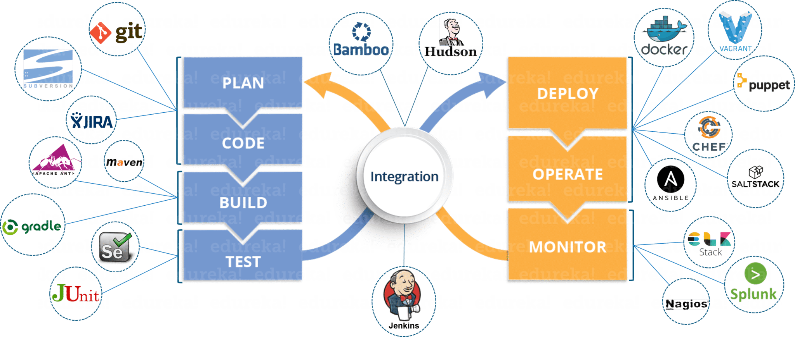
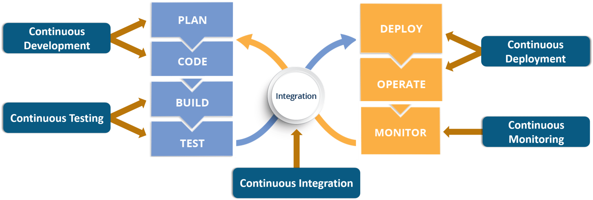
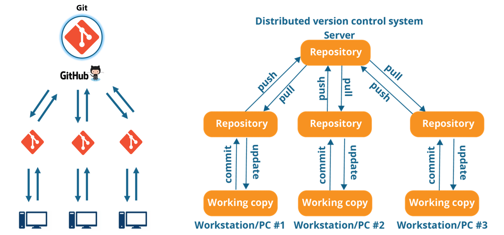
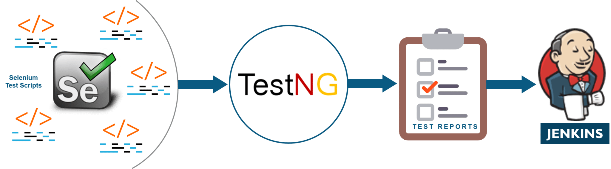
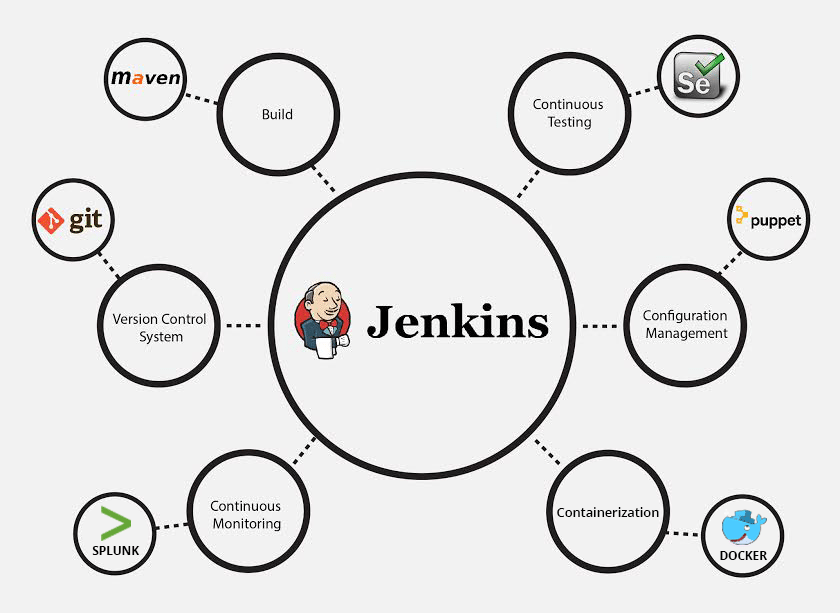
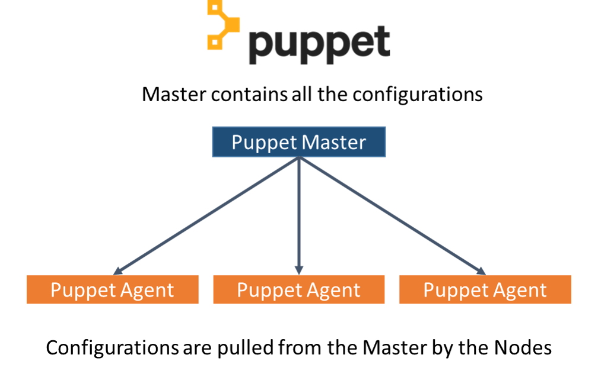
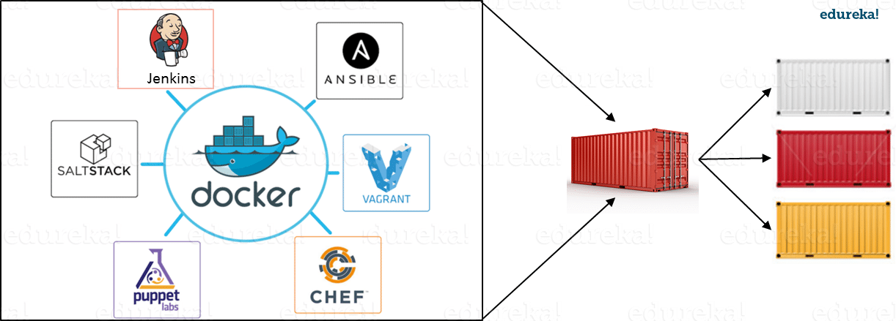

= DevOps Tools
Before going any further, let’s recap what are the different tools and where they fall in the DevOps lifecycle.

Most Used DevOps Tools

DevOps Lifecycle Phases (DevOps Tools)
Well i’m pretty sure you’re impressed with the above image. But, you might still have problems relating the tools to various phases. Don’t you? 

In that case, let’s take a step back and first understand what are the various phases present in the DevOps lifecycle. Below are the 5 different phases any software/ application has to pass through, when developed via the DevOps lifecycle:-

. Continuous Development
. Continuous Testing
. Continuous Integration
. Continuous Deployment
. Continuous Monitoring

Phases explained - DevOps tools

== 1. Continuous Development
This is the phase which involves ‘planning‘ and ‘coding‘ of the software application’s functionality. There are no tools for planning as such, but there are a number of tools for maintaining the code.

The vision of the project is decided during the ‘planing’ phase and the when they start writing the code, the act is referred to as ‘coding’ phase.

The code can be written in any language, but it is maintained by using Version Control tools. These are the Continuous Development DevOps tools. The most popular tools used are: Git, SVN, Mercurial, CVS and JIRA.

So why is it important to main versions of the code? Which of the Dev vs Ops problem does it solve? Let’s understand that first.

Course Curriculum
DevOps Certification Training
Instructor-led SessionsReal-life Case StudiesAssignmentsLifetime Access
Versions are maintained (in a central repository), to hold a single source of truth. So that all the developers can collaborate on the ‘latest committed’ code, and even operations can have access to that same code when they plan to make a release.
Whenever a mishap happens during a release, or even if there are lots of bugs in the code (faulty feature), there is nothing to worry. Ops can quickly rollback the deployed code and thus revert back to the previous stable state.
So, which is my favorite tool? That has got to be Git & GitHub. Why? Because Git allows developers to collaborate with each other on a Distributed VCS (Version Control System).

Since there is no dependency on the central server, ‘pulls’ & ‘pushes’ to the repository can be made from remote locations. This central repository where the code is maintained is called GitHub.

git - devops tools

Git is in-fact the world’s leading Version Control system. If you don’t want to take my word for it, you can just google that up. So let’s move on to the next topic in this DevOps tools blog. You can read more about Git from here: What is Git?

== 2. Continuous Testing
When the code is developed, it is maddening to release it straight to deployment. The code should first be tested for bugs and performance. Can we agree on that statement?

If yes, then what would be the procedure to perform the tests? Would it be manual testing? Well, it can be, but it is very inefficient. So, what is better? Automation testing? Exactly! Sounds amazing right?

Automation testing is the answer to a lot of cries of manual testers. Tools like Selenium, TestNG, JUnit/ NUnit are used to automate the execution of our test cases. So, what are its benefits? 

Automation testing saves a lot of time, effort and labor for executing the tests manually.
Besides that, report generation is a big plus. The task of evaluating which test cases failed in a test suite gets simpler.
These tests can also be scheduled for execution at predefined times. Brilliant right?
And the continuous use of these tools while developing the application is what forms the ‘Continuous Testing‘ phase during DevOps lifecycle. Which of these is my favorite tool? A combination of these tools actually!

Selenium is my favorite, but Selenium without TestNG is equivalent to a snake without a poisonous sting, atleast from the perspective of DevOps lifecycle.

Selenium does the automation testing, and the reports are generated by TestNG. But to automate this entire testing phase, we need a trigger right? So, what is the trigger? This is where the role of Continuous Integration tools like Jenkins coming into the picture.

selenium testng jenkins - devops tools
You can read more about Selenium and automation testing from this blog of mine: What is Selenium? Now, lets move onto the next topic in this DevOps tools blog.

== 3. Continuous Integration
This is the most brilliant DevOps phase. It might not make sense during the first cycle of release, but then you will understand this phase’s importance going forward.

Wait, that is not completely correct. Continuous Integration (CI) plays a major role even during the first release. It helps massively to integrate the CI tools with configuration management tools for deployment.

DevOps
Training
Undisputedly, the most popular CI tool in the market is Jenkins. And personally, Jenkins is my favorite DevOps tool. Other popular CI tool are Bamboo and Hudson.

Why do I hold such a high regard for Continuous Integration tools? Because they are the one’s which hold the entire ‘DevOps structure’ together.

It is the CI tools which orchestrates the automation of tools falling under other DevOps lifecycle phases. Be it, Continuous Development tools, or Continuous Testing tools, or Continuous Deployment tools, or even Continuous Monitoring tools, the Continuous Integration tools can be integrated with all of them.

When integrated with Git/ SVN, Jenkins can schedule jobs (pulling the code from shared repositories) automatically and make it ready for builds and testing (Continuous Development). Jenkins can build jobs either at scheduled times of day or when ever there is a commit pushed to the central repository.
When integrated with testing tools like Selenium, we can achieve Continuous Testing. How? The developed code can be built using tools like Maven/ Ant/ Gradle.
When the code is built, then Selenium can automate the execution of that code. How does it automate it? By creating a suite of test cases and executing the test cases one after the other.
The role of Jenkins/ Hudson/ Bamboo here would be to schedule/ automate “Selenium to automate test case execution”.
When integrated with Continuous Deployment tools, Jenkins/ Hudson/ Bamboo can trigger the deployments planned by configuration management/ containerization tools.
And finally, Jenkins/ Hudson can be integrated with monitoring tools like Splunk/ ELK/ Nagios/ NewRelic, to continuously monitor the status & performance of the server where the deployments have been made.
jenkins ci - devops tools

Because CI tools are capable of this and so much more, they are my favorite. Hence my statement: Jenkins is an elementary DevOps tool. You can read more about Jenkins here: What is Jenins?

== 4. Continuous Deployment
This (Continuous Deployment) is the phase where action actually happens. We have seen the tools which help us build the code from scratch and also those tools which help in testing. Now it is time to understand why DevOps will be incomplete without Configuration Management tools or Containerization tools. Both set of tools here help in achieving Continuous Deployment (CD).

Configuration Management Tools
Configuration Management is the act of establishing and maintaining consistency in an applications’ functional requirements and performance. In simpler words, it is the act of releasing deployments to servers, scheduling updates on all servers and most importantly keeping the configurations consistent across all the severs.
For this, we have tools like Puppet, Chef, Ansible, SaltStack and more. But the best tool here is Puppet. Puppet & the other CM tools work based on the master-slave architecture. When there is a deployment made to the master, the master is responsible for replicating those changes across all the slaves, no matter the number! Amazing right?

puppet architecture - devops tools

You can read more about Puppet here: What is Puppet? Now let’s move onto Containerization.
Containerization Tools
Containerization tools are other set of tools which help in maintaining consistency across the environments where the application is developed, tested and deployed. It eliminates any chance of errors/ failure in production environment by packaging and replicating the same dependencies and packages used in development/ testing/ staging environment.
The clear winner here is Docker, which was among the first containerization tool ever. Earlier, this act of maintaining consistency in environments was a challenge because VMs and servers were used, and their environments would have to be managed manually to achieve consitency. Docker containers threw this challenge up above and blew it out of the water. (Pun intended!)

Docker Integrations - What Is Docker Container

Another containerization tool is Vagrant. But off-late, a number of cloud solutions have started providing support for container services. Amazon ECS, Azure  Container Service and Google Container Engine are a few of the cloud services that have started radical support for Docker containers. This is the reason why Docker is the clear winner.
You can read more about Docker from here: What is Docker? So now, let’s move on to the final topic in this DevOps tools blog.

== 5. Continuous Monitoring
Well, what is the point of developing an application and deploying it, if we do not monitor its performance. Monitoring is as important as developing the application because there will always be a chance of bugs which escape undetected during the testing phase.

Which tools fall under this phase? Splunk, ELK Stack, Nagios, Sensu, NewRelic are some of the popular tools for monitoring. When used in combination with Jenkins, we achieve Continuous Monitoring. So, how does monitoring help?

To minimize the consequences of buggy features, monitoring is a big add-on. Buggy features most often tend to cause financial loss. So, all the more reason to perform continuous monitoring.
Monitoring tools also report failure/ unfavorable conditions before your clients/ customers get to experience the faulty features. Don’t we all prefer this?
Which is my favorite tool here? I would prefer either Splunk or ELK stack. These two tools are major competitors. They pretty much provide the same features. But the way they provide the functionality is where they are different.

Splunk is a propriety tool (paid tool). But, this also effectively means that working on Splunk is very easy. ELK stack however, is a combination of 3 open-source tools: ElasticSearch, LogStash & Kibana. It maybe free, but setting it up is not as easy as a commercial tool like Splunk. You can try both of them to figure out the better for your organization. You can read more about Splunk here: What is Splunk? 

Course Curriculum
DevOps Certification Training
Weekday / Weekend Batches
Well these were the various phases of the DevOps lifecycle and the tools that fit seamlessly in those situations. I hope you understood the application of these DevOps tools in the industry.