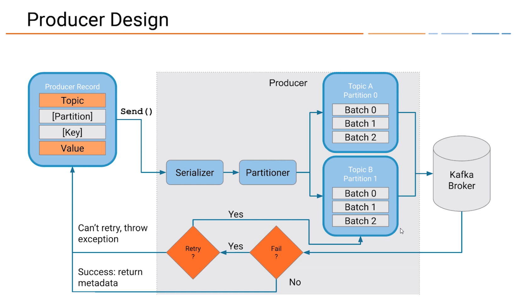

:toc: auto
:toc-position: left
:toclevels: 3

= Kafka
Patsoo08 <patty.randri8@gmail.com>

Zookeeper: qui est utilisé par Kafka pour maintenir l'état entre les nœuds du cluster.
Broker Kafka: Les «tuyaux» de notre pipeline, qui stockent et émettent des données.
Producteurs: qui insèrent des données dans le cluster.
Consommateurs: qui lisent les données du cluster.

== Installer Kafka avec 4 brokers

	export ZOO=localhost:2181

# first, we start ZOOKEEPER
	
	nohup ./$kfkBIN/zookeeper-server-start.sh ../config/zookeeper.properties &

# start ZOO configuration with 4 brokers
	nohup ./$kfkBIN/kafka-server-start.sh ../config/server_1.properties &
	nohup ./$kfkBIN/kafka-server-start.sh ../config/server_2.properties &
	nohup ./$kfkBIN/kafka-server-start.sh ../config/server_3.properties &
	nohup ./$kfkBIN/kafka-server-start.sh ../config/server.properties &
	
# tester ZOO et KAFKA

	ss -ta | grep 21
	ss -ta | grep 90

	nc -vz [zookeper:port]

# creation de Topics
	./$kfkBIN/kafka-topics.sh --create --topic my-kafka-topic --zookeeper localhost:2181 --partitions 3 --replication-factor 2
	./$kfkBIN/kafka-topics.sh --describe --topic monTopic --zookeeper $ZOO
	./$kfkBIN/kafka-console-producer.sh --broker-list localhost:9091,localhost:9092,localhost:9095 --topic monTopic 
	./$kfkBIN/kafka-console-consumer.sh --bootstrap-server localhost:9093 --topic monTopic --from-beginning

== KAFKA REST proxy

.`DOCKERFILE`
****
docker run -d \
  --net=host \
  --name=schema-registry \
  -e SCHEMA_REGISTRY_KAFKASTORE_CONNECTION_URL=localhost:2181 \
  -e SCHEMA_REGISTRY_HOST_NAME=localhost \
  -e SCHEMA_REGISTRY_LISTENERS=http://localhost:8081 \
  -e SCHEMA_REGISTRY_DEBUG=true \
  confluentinc/cp-schema-registry:5.4.1
****

****
docker run -d \
  --net=host \
  --name=kafka-rest \
  -e KAFKA_REST_ZOOKEEPER_CONNECT=localhost2:181 \
  -e KAFKA_REST_LISTENERS=http://localhost:8082 \
  -e KAFKA_REST_SCHEMA_REGISTRY_URL=http://localhost:8081 \
  confluentinc/cp-kafka-rest:5.4.1
****

.`Dockercompose`

****version: '3'
services: 

  kafka-schema:
    image: confluentinc/cp-schema-registry:5.4.1
    network_mode: "host"
    environment:
      - SCHEMA_REGISTRY_KAFKASTORE_CONNECTION_URL=localhost:2181
      - SCHEMA_REGISTRY_HOST_NAME=localhost
      - SCHEMA_REGISTRY_LISTENERS=http://localhost:8081
      - SCHEMA_REGISTRY_DEBUG=true
  kafka-rest:
    image: confluentinc/cp-kafka-rest:5.4.1
    network_mode: "host"
    environment:
      - KAFKA_REST_HOSTNAME=localhost:8088
      - KAFKA_REST_ZOOKEEPER_CONNECT=localhost:1281
      - KAFKA_REST_LISTENERS=http://localhost:8082
      - KAFKA_REST_SCHEMA_REGISTRY_URL=http://localhost:8081
    depends_on:
      - kafka-schema

****

== KAFKA Commandes

=== section  les topics
Vous pouvez créer un nouveau sujet Kafka nommé my-topic comme suit:

	kafka-topics --create --zookeeper localhost: 2181 --replication-factor 1 --partitions 3 --topic my-topic

Vous pouvez vérifier que le sujet my-topic a été créé avec succès en répertoriant tous les topics disponibles:

	kafka-topics --list --zookeeper localhost: 2181

Vous pouvez ajouter plus de partitions comme suit:

	kafka-topics --zookeeper localhost: 2181 --alter --topic my-topic --partitions 16

Vous pouvez supprimer un sujet nommé my-topic comme suit:

	kafka-topics --zookeeper localhost: 2181 --delete --topic my-topic

Vous pouvez trouver plus de détails sur un sujet nommé cc_payments comme suit:

	kafka-topics --describe --zookeeper localhost: 2181 --topic cc_payments

Vous pouvez voir les partitions sous-répliquées pour tous les topics comme suit:

	kafka-topics --zookeeper localhost: 2181 / kafka-cluster --describe --under-replicated-partitions

=== section  Producteurs
Vous pouvez produire des messages à partir d'une entrée standard comme suit:

	kafka-console-producteur --broker-list localhost: 9092 --topic my-topic

Vous pouvez produire de nouveaux messages à partir d'un fichier existant nommé messages.txt comme suit:

	kafka-console-producteur --broker-list localhost: 9092 - test de sujet <messages.txt

Vous pouvez produire des messages Avro comme suit:
	
kafka-avro-console-producteur --broker-list localhost: 9092 --topic my.Topic --property value.schema = '{"type": "record", "name": "myrecord", "fields": [{"nom": "f1", "type": "chaîne"}]} '--property 
schema.registry.url = http: // localhost: 8081
Vous pouvez entrer quelques nouvelles valeurs à partir de la console comme suit:

{"f1": "value1"}

=== section  Consumers

Consommer des messages
Vous pouvez commencer un consommateur depuis le début du journal comme suit:

	kafka-console-consumer --bootstrap-server localhost: 9092 --topic my-topic --from-begin

> Commande important après avoir supprimer un topic pour le reinitialiser par la suite

Vous pouvez consommer un seul message comme suit:

	kafka-console-consumer --bootstrap-server localhost: 9092 --topic my-topic --max-messages 1

Vous pouvez consommer un seul message de __consumer_offsets comme suit:

	kafka-console-consumer --bootstrap-server localhost: 9092 --topic __consumer_offsets --formatter 'kafka.coordinator.GroupMetadataManager $ OffsetsMessageFormatter' --max-messages 1

Vous pouvez consommer et spécifier un groupe de consommateurs comme suit:

	kafka-console-consumer --topic my-topic --new-consumer --bootstrap-server localhost: 9092 --consumer-property group.id = my-group

Consommer des messages Avro
Vous pouvez utiliser 10 messages Avro à partir d'un sujet nommé position-reports comme suit:

	kafka-avro-console-consumer - rapports de position du sujet --new-consumer --bootstrap-server localhost: 9092 --from-starting --property schema.registry.url = localhost: 8081 --max-messages 10

Vous pouvez consommer tous les messages Avro existants à partir d'un sujet nommé position-reports comme suit:

	kafka-avro-console-consumer - rapports de position de sujet --new-consumer --bootstrap-server localhost: 9092 --from-starting --property schema.registry.url = localhost: 8081

Opérations d'administration des consommateurs
Vous pouvez répertorier tous les groupes comme suit:

	kafka-consumer-groups --new-consumer --list --bootstrap-server localhost: 9092

Vous pouvez décrire un groupe nommé testgroup comme suit:

	kafka-consumer-groups --bootstrap-server localhost: 9092 --describe --group testgroup

=== section  Config
Vous pouvez définir la rétention d'un sujet comme suit:

	kafka-configs --zookeeper localhost: 2181 --alter - rubriques de type entité - nom-entité my-topic --add-config retention.ms = 3600000

Vous pouvez imprimer tous les remplacements de configuration pour un sujet nommé my-topic comme suit:

	kafka-configs --zookeeper localhost: 2181 --describe --entity-type topics --entity-name my-topic

Vous pouvez supprimer un remplacement de configuration pour retention.ms pour un sujet nommé my-topic comme suit:

	kafka-configs --zookeeper localhost: 2181 --alter - rubriques de type entité - nom-entité my-topic --delete-config retention.ms

Performance
Bien que Kafka soit assez rapide par conception, il est bon de pouvoir tester ses performances. Vous pouvez vérifier les performances de production de Kafka comme suit:

	kafka-producteur-perf-test - rapports de position des topics - débit 10000 - taille d'enregistrement 300 - nombre d'enregistrements 20000 - accessoires de production bootstrap.servers = "localhost: 9092"

=== section  ACL
Vous pouvez ajouter une nouvelle ACL de consommateur à un sujet existant comme suit:

	kafka-acls --authorizer-properties zookeeper.connect = localhost: 2181 --add --allow-principal Utilisateur: Bob --consumer - topic topicA --group groupA

Vous pouvez ajouter une nouvelle ACL de producteur à un sujet existant comme suit:

	kafka-acls --authorizer-properties zookeeper.connect = localhost: 2181 --add --allow-principal User: Bob --producer --topic topicA

Vous pouvez répertorier les ACL d'un sujet nommé topicA comme suit:

	kafka-acls --authorizer-properties zookeeper.connect = localhost: 2181 --list --topic topicA

=== section  Zookeeper
Vous pouvez entrer dans le shell zookeeper comme suit:

	zookeeper-shell localhost: 2182 ls

=== section  TOOLS:

CMAK: https://github.com/yahoo/CMAK

Burrow : https://github.com/linkedin/Burrow

=== section  Docker

	docker run -it --rm  -p 9000:9000 -e ZK_HOSTS="your-zk.domain:2181" -e APPLICATION_SECRET=letmein -e KM_ARGS=-Djava.net.preferIPv4Stack=true sheepkiller/kafka-manager 

ou

	docker run -d --name kafka-manager -p 9000:9000 \
	-e ZK_HOSTS="alpha:2181,beta:2181,gamma:2181" \
	--restart always \
	--log-driver json-file --log-opt max-size=10m \
	sheepkiller/kafka-manager -Djava.net.preferIPv4Stack=true

==== section  Activer JMX
JMX doit être activé pour les afficher dans kafka-manager.

	KAFKA_JMX_OPTS: "-Dcom.sun.management.jmxremote \
	  -Dcom.sun.management.jmxremote.authenticate = false \
	  -Dcom.sun.management.jmxremote.ssl = false \
	  -Djava.rmi.server.hostname = {{ansible_hostname}} \
	  -Dcom.sun.management.jmxremote.rmi.port = 9099 "
	JMX_PORT: 9099

Faites attention au port JMX exposé. Vous pouvez choisir n'importe quel port. Je pense que le port 9099 convient, car le port exposé par défaut est 9092.

=== section  Docker compose

	version: '3.1'
	
	services:
	  zookeeper:
	    container_name: zookeeper
	    image: zookeeper:3.4
	    restart: on-failure
	    volumes:
	      - "./zookeeper/data:/data"
	      - "./zookeeper/logs:/datalog"
	    ports:
	      - "2181:2181"
	    network_mode: "host"
	
	  kafka:
	    container_name: kafka
	    image: wurstmeister/kafka:1.0.0
	    restart: on-failure
	    depends_on:
	      - zookeeper
	    volumes:
	      - /var/run/docker.sock:/var/run/docker.sock
	    environment:
	      - KAFKA_ZOOKEEPER_CONNECT=${EXPOSED_HOSTNAME}:2181
	      - KAFKA_ADVERTISED_HOST_NAME=${EXPOSED_HOSTNAME}
	      - JMX_PORT=9093
	      - KAFKA_ADVERTISED_PORT=9092
	      - KAFKA_DELETE_TOPIC_ENABLE=true
	      - KAFKA_LOG_RETENTION_HOURS=1
	      - KAFKA_MESSAGE_MAX_BYTES=10000000
	      - KAFKA_REPLICA_FETCH_MAX_BYTES=10000000
	      - KAFKA_GROUP_MAX_SESSION_TIMEOUT_MS=60000
	      - KAFKA_NUM_PARTITIONS=2
	      - KAFKA_DELETE_RETENTION_MS=1000
	    ports:
	      - "9092:9092"
	      - "9093:9093"
	    network_mode: "host"
	
	  kafka-manager:
	    container_name: kafka-manager
	    image: hlebalbau/kafka-manager:1.3.3.16
	    restart: on-failure
	    depends_on:
	      - kafka
	      - zookeeper
	    command: -Dconfig.file=/kafka-manager/conf/application.conf -Dapplication.home=/kafkamanager
	    ou 
	    command: -Dpidfile.path=/dev/null
	    environment:
	      - ZK_HOSTS=${EXPOSED_HOSTNAME}
	      - APPLICATION_SECRET=letmein
	    ports:
	      - "9000:9000"
	    network_mode: "host"

	https://www.playframework.com/documentation/2.7.x/ProductionConfiguration#Changing-the-path-of-RUNNING_PID

=== section  tricks

	https://dev.to/thegroo/one-to-run-them-all-1mg6

	https://jrblog.pentaidea.com/john/2019/03/29/build-3-nodes-1-cluster-kafka-zookeeper-kafka-manager-envirnment-by-docker-compose/
